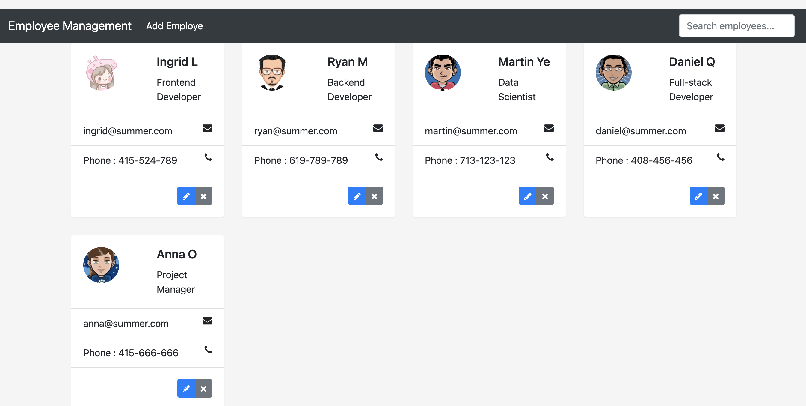

# 👔 Employee Management 👨‍💻‍

This simple spring boot java application is the perfect way to practice as your first full-stack project!

Get the resource code:
- git clone https://github.com/summeringrid/Small-Side-Project-4-MVC-Employee.git

